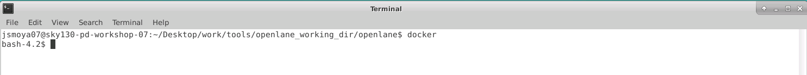
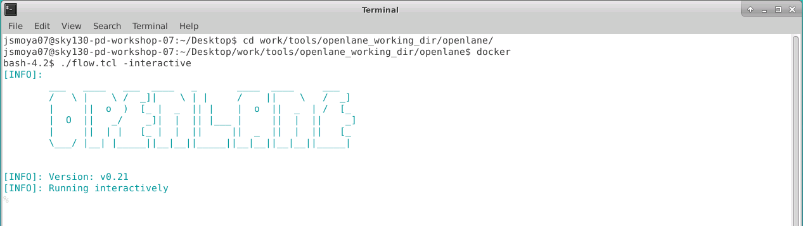
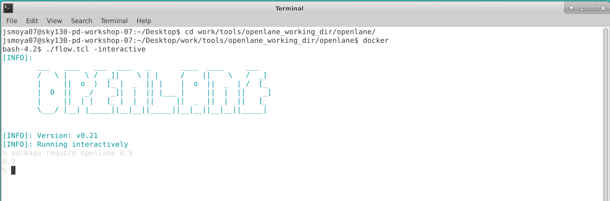
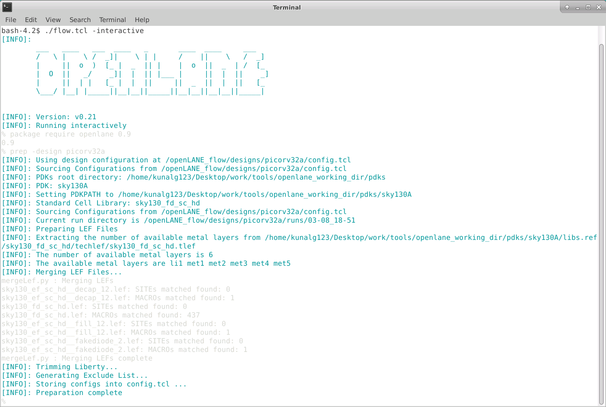
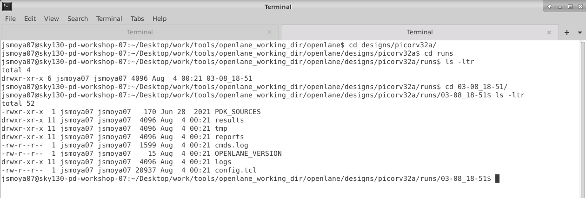
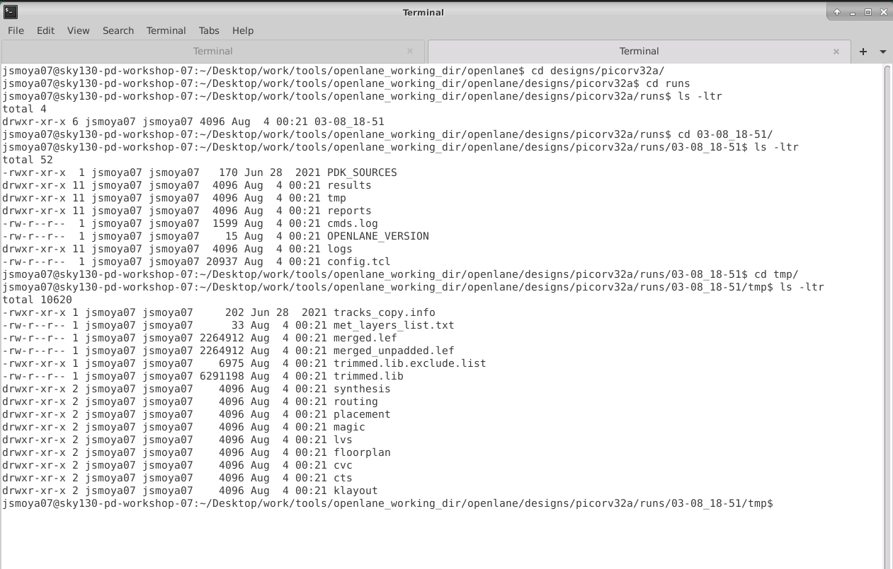
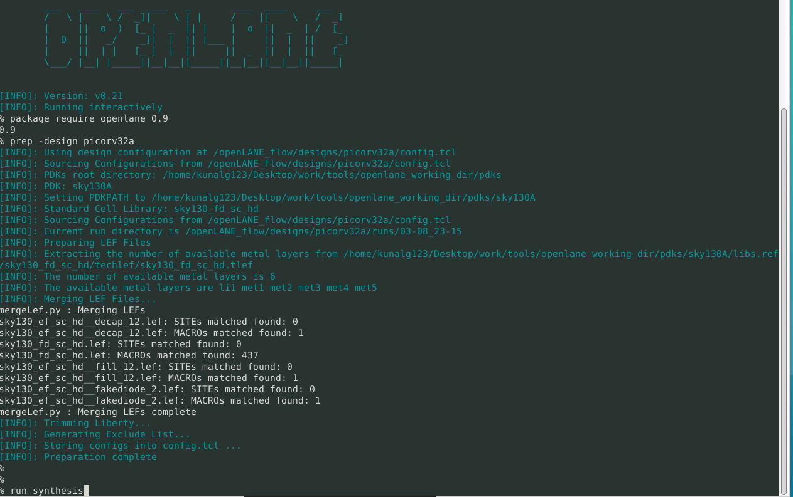
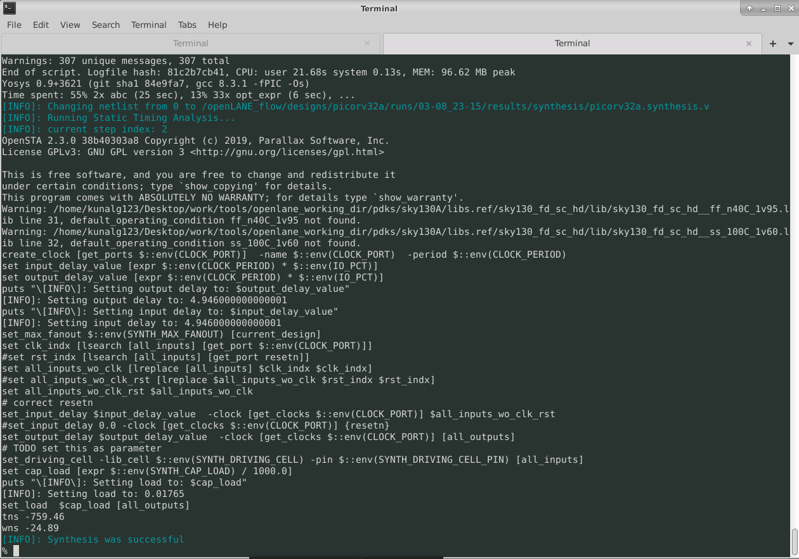

# SKY130-PD-workshop
Here you can find all the material that I developed from the SKY 130 PD workshop.

## Sky130 Day 1 - Inception of open-source EDA, OpenLANE and SKY130 PDK (Lab Instance 1)

We use the "docker" command to invoke openlane.

We type the "./flow.tcl - interactive" command to run the openLANE flow.

We type the "package require openlane 0.9" command to load all the packages needed in the openLANE flow.

The three commands mentioned above must be executed everytime we want to run the openLANE flow.

We prepare the design setup stage with thrv32a-e command "prep -design picorv32a"

Then, we review the files after design preparation and run synthesis.

Then, we type the "run_synthesis" command.

We observe that the synthesis is completed sucessfully.
